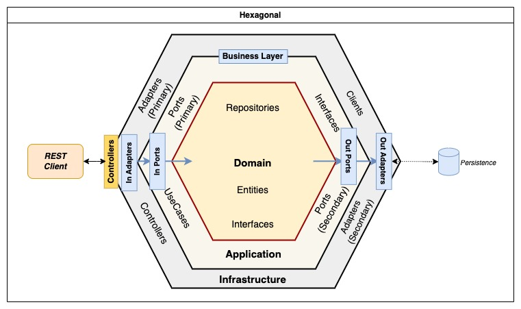

**Diagrama de la solución:**

**Stack Tecnológico:**

- NodeJs
- Docker
- MongoDB
- Kafka

**Arquitectura Hexagonal:**

**Requerimientos:**

*Se necesita tener instalado Docker, la aplicación se encuentra dockerizada en su totalidad para que sea compatible en cualquier servidor que soporte contenedores en Docker.*

Para levantar el proyecto se debe ejecutar el siguiente comando **"docker-compose up -d"**, en la raíz del proyecto, desde un terminal.

**Explicación de la solución:**

Los usuarios realizan movimientos transaccionales desde un cliente ya sea web o app, se realiza la petición al servicio el cual recibe la solicitud, registra la transacción en estado *"pending"* mientras se envía a un servicio de colas *"anti-fraude"* que se encarga de revisar si la transacción es legible o no, el cual realiza su proceso de validación con las reglas de negocio, por ejemplo en esta ocasión, si el monto supera 1000 emite un evento de actualización de la transacción con estado *"rejected"*, y si cumple correctamente las reglas, se envía a actualizar el estado a *"approved"*, este evento es enviado a una cola *"transaction-status"*, que se encarga de actualizar el estado de la transacción en la base, esta separación de colas se realizan con el fin de mantener alta disponibildad en los servicios de frente al cliente.